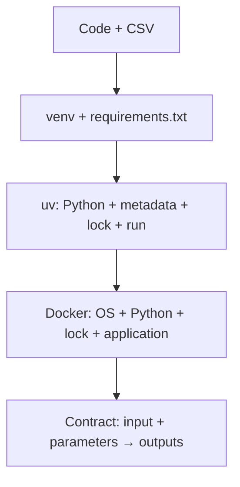

# Tutorial overview

## The scientific computation stays fixed

The supplied project analyses Mel's 50 temperature/ice-cream observations. It:

1. reads the CSV without modifying it;
2. removes missing values and impossible negative ice-cream counts;
3. fits polynomial models of degree 1, 2, and 3 and a cubic-spline model, each with and without an intercept;
4. computes training RMSE and BIC;
5. computes held-out RMSE and MAE-derived accuracy with shuffled five-fold cross-validation;
6. ranks all eight models and predicts at 40 °C;
7. exports a ranking table, JSON summary, and two figures.

Read `SPEC.md`, `src/`, and the tests in stage 1. The environment changes later; the analysis does not.

## Reproducibility ladder

Each level controls more of the execution. None replaces Git, data versioning, tests, documentation, or run provenance.

## Ground rule

An environment migration is successful only when the original tests pass, the input checksum is unchanged, and equivalent inputs and parameters produce equivalent tables.
